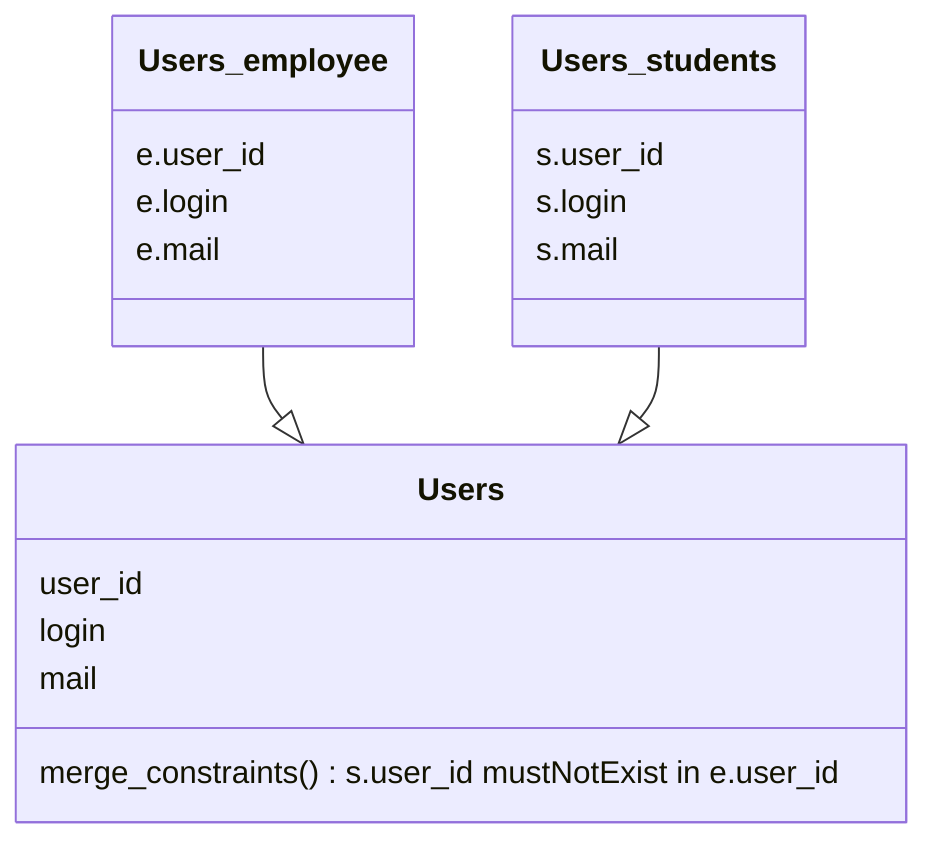
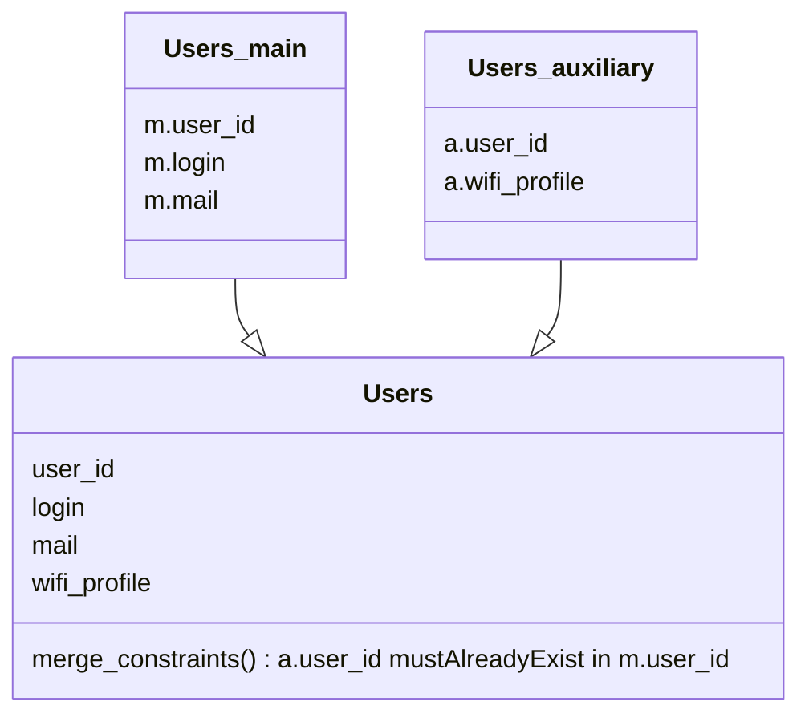
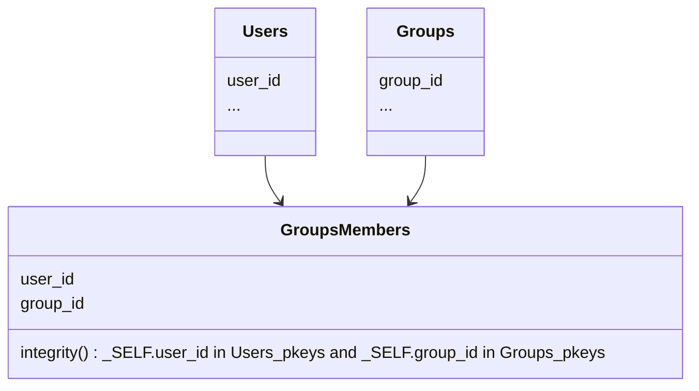

- Doesn't require any change to sources data model (ie. no need to add `last_updated` column)
- [Multi-source](#multi-source), with ability to set [merge](#merging-data)/[aggregation](#aggregating-data) constraints
- Able to handle several data types, with link (*foreign keys*) between them, and to enforce [integrity constraints](#integrity-constraints)
- Able to transform data with [Jinja filters](https://jinja.palletsprojects.com/en/3.1.x/templates/#filters)
- Clean error handling, to avoid synchronization problems, and an optional mechanism of error remediation
- Offer a trashbin on clients for removed data
- Insensitive to unavailability and errors on each link (source, message bus, target)
- Evolutive by design. All following items are implemented as plugins :
  - Datasources
  - Attributes filters (data filters)
  - Clients (targets)
  - Messagebus

## Multi-source

Hermes-server is able to poll multiple sources and merge or aggregate their data as if it was providing of the same source. It is even possible to set merge/aggregation constraints to ensure data consistency.

### Merging data

Let's work with a university data set, where Hermes should manage user accounts and employees and students are stored in different datasources. Hermes will be able to merge the two datasources in one virtual `Users`, but must ensure that primary keys are differents.

Here we got two distinct data sources for a same data type.

### Aggregating data

Another use case, where Hermes should manage user accounts and main data and wifi profile's name are stored in different datasources. Hermes will be able to aggregate the two datasources in one virtual `Users`, but must ensure that primary keys of second exists in first.

Here we got two distinct data sources for a same entry.

## Integrity constraints

Hermes-server is able to handle several data types, with link (*foreign keys*) between them, and to enforce integrity constraints.

Let's use a typical Users / Groups / GroupsMember use case to illustrate this.

