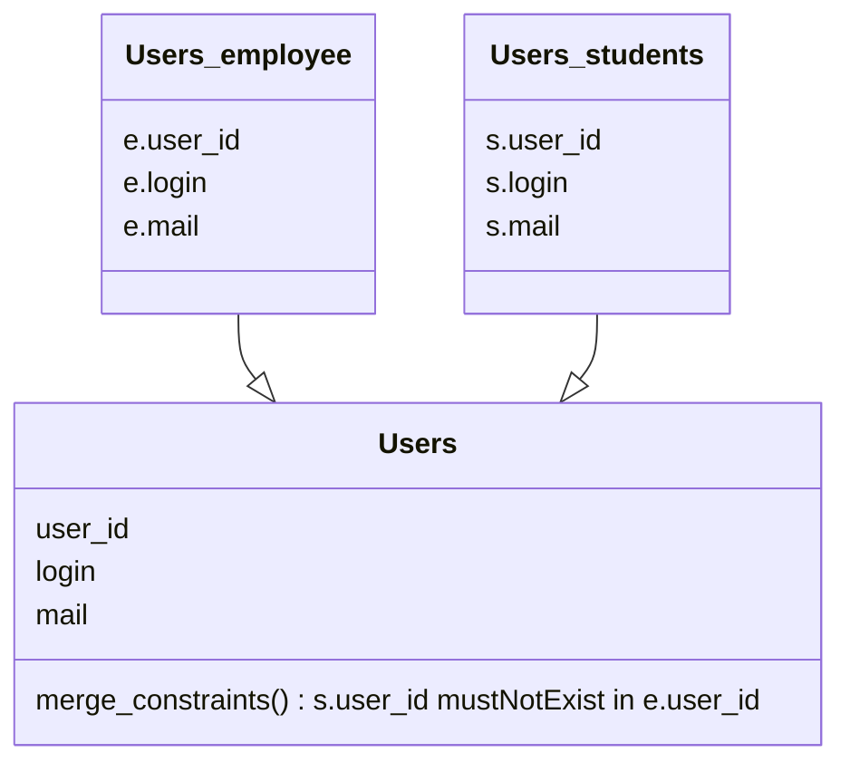

Dans un scénario multi-sources, Hermes peut aggréger les entrées provenant de plusieurs sources comme si elles provenaient d'une seule, et éventuellement appliquer des contraintes d'agrégation pour garantir la cohérence des données.

Prenons un cas d'utilisation, avec un ensemble de données universitaires utilisées par Hermes pour gérer les comptes utilisateurs. Les données du personnel et des étudiants sont stockées sur deux sources de données distinctes. Hermes pourra fusionner les deux sources de données dans un seul type `Users` virtuel, tout en s'assurant qu'il n'y ait pas de collision entre les clés primaires.

Ici, nous avons deux sources de données distinctes pour un même type de données.

Dans ce scénario, les entrées dans `Users_students` qui ont un `user_id` qui existe dans `Users_employee` seront ignorées silencieusement.
Mais les entrées dans `Users_employee` qui ont un `user_id` qui existe dans `Users_students` seront toujours traitées.

Pour plus de détails, veuillez consulter [pkey_merge_constraint](/setup/configuration/hermes-server/#hermes-server.datamodel.data-type-name.sources.datasource-name.pkey_merge_constraint) et [merge_constraints](/setup/configuration/hermes-server/#hermes-server.datamodel.data-type-name.sources.datasource-name.merge_constraints) dans la configuration d'hermes-server.
