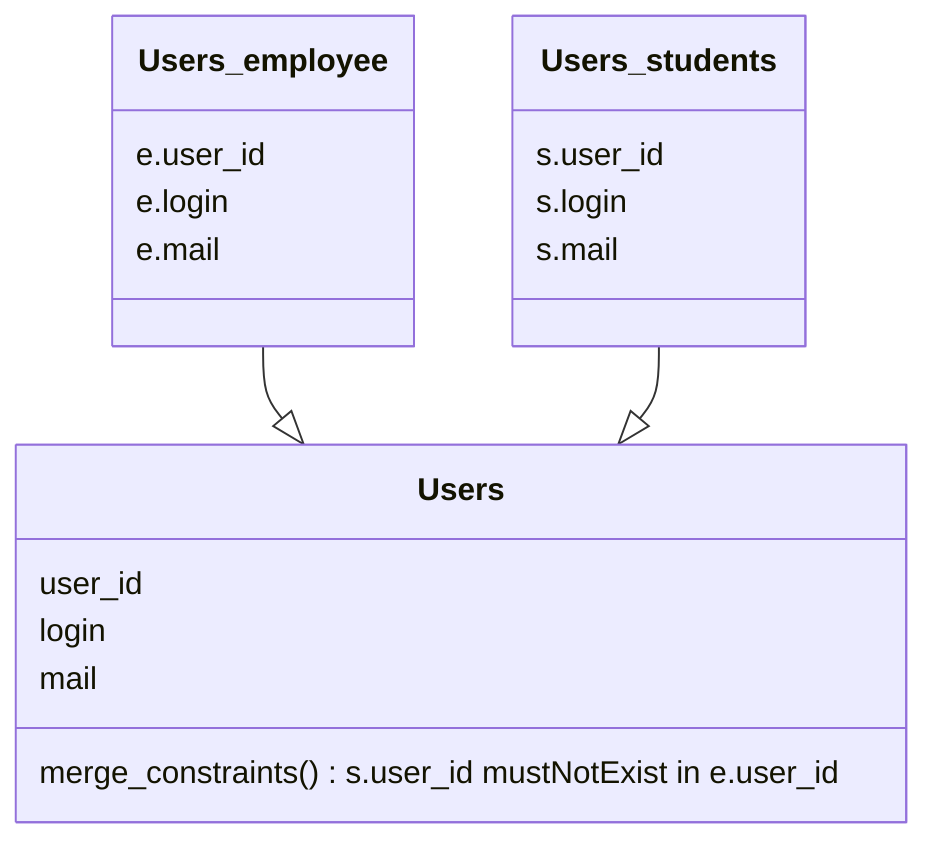

In a multi-source scenario, Hermes can aggregate entries providing from multiple sources as if they were providing from one, and optionally enforce aggregation constraints to ensure data consistency.

Let's take a use case, with a university data set where Hermes should manage user accounts. Employees and students data are stored on two separate data sources. Hermes will be able to merge the two datasources in one virtual `Users`, but must ensure that primary keys doesn't collide.

Here we got two distinct data sources for a same data type.

In this scenario, entries in `Users_students` that have a `user_id` that exist in `Users_employee` will be silently ignored.  
But entries in `Users_employee` that have a `user_id` that exist in `Users_students` will still be processed.

For more details, please see [pkey_merge_constraint](../../../setup/configuration/hermes-server/#hermes-server.datamodel.data-type-name.sources.datasource-name.pkey_merge_constraint) and [merge_constraints](../../../setup/configuration/hermes-server/#hermes-server.datamodel.data-type-name.sources.datasource-name.merge_constraints) in hermes-server configuration.
