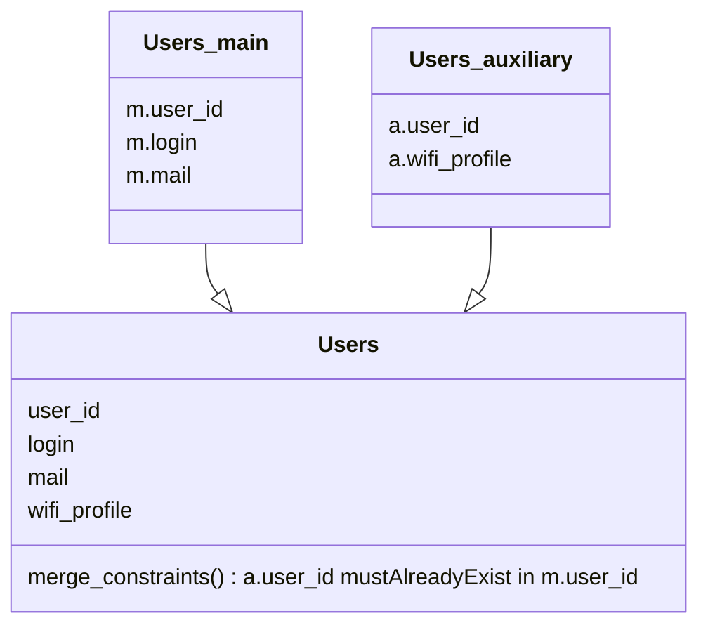

Dans un scénario multi-sources, Hermes peut recomposer des entrées provenant de plusieurs sources en fusionnant leurs données et en définissant éventuellement des contraintes de fusion pour assurer la cohérence des données.

Prenons un cas d'utilisation, où Hermes gère des comptes utilisateurs. Les données principales et le nom du profil wifi sont stockés sur deux sources de données distinctes. Hermes pourra agréger les deux sources de données dans un seul objet `Users` virtuel, tout en s'assurant que les clés primaires de la seconde source existent dans la première.

Ici, nous avons deux sources de données distinctes pour une même entrée.

Dans ce scénario, les entrées dans `Users_auxiliary` qui ont un `user_id` qui n'existe pas dans `Users_main` seront ignorées silencieusement.
Mais les entrées dans `Users_main` qui ont un `user_id` qui n'existe pas dans `Users_auxiliary` seront traitées, et donc l'entrée `Users` résultante n'aura pas de valeur `wifi_profile`.

Pour plus de détails, veuillez consulter [pkey_merge_constraint](/setup/configuration/hermes-server/#hermes-server.datamodel.data-type-name.sources.datasource-name.pkey_merge_constraint) et [merge_constraints](/setup/configuration/hermes-server/#hermes-server.datamodel.data-type-name.sources.datasource-name.merge_constraints) dans la configuration d'hermes-server.
