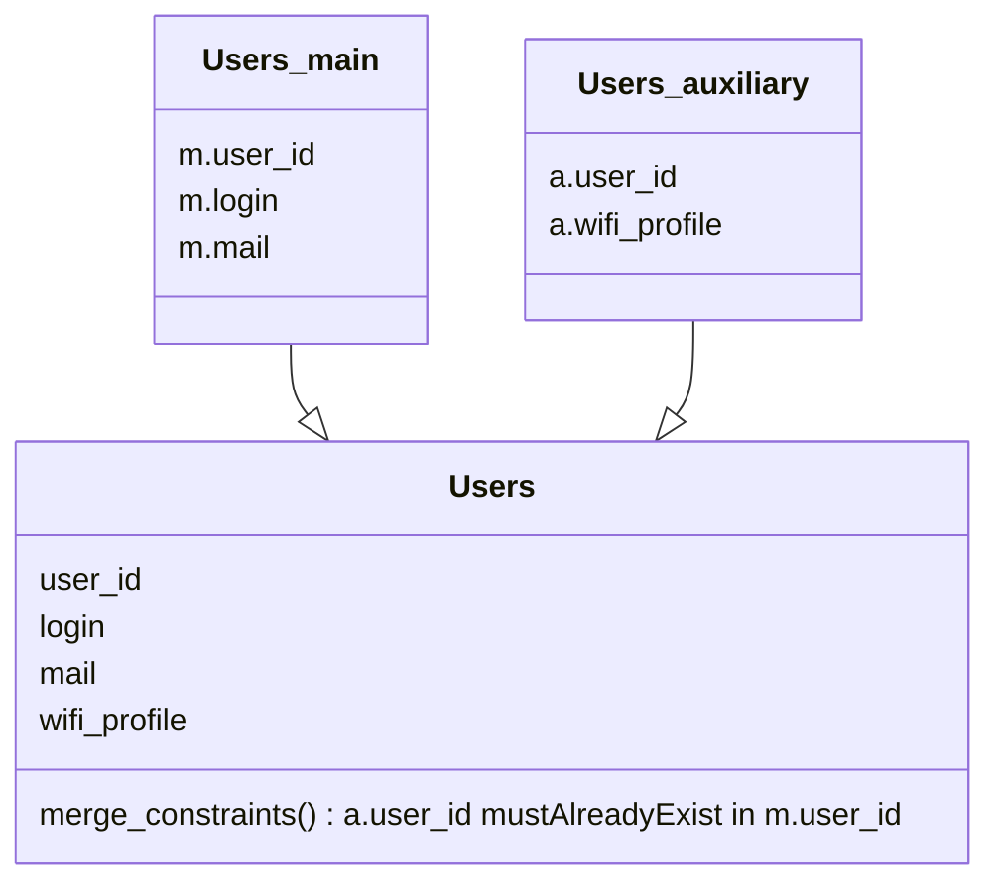

In a multi-source scenario, Hermes is able to recompose entries providing of multiple source by merging their data, and optionally setting merge constraints to ensure data consistency.

Let's take a use case, where Hermes should manage user accounts. Main data and wifi profile name are stored on two separate data sources. Hermes will be able to aggregate the two datasources in one virtual `Users`, but must ensure that primary keys of second exists in first.

Here we got two distinct data sources for a same entry.

In this scenario, entries in `Users_auxiliary` that have a `user_id` that doesn't exist in `Users_main` will be silently ignored.  
But entries in `Users_main` that have a `user_id` that doesn't exist in `Users_auxiliary` will be processed, and therefore the resulting `Users` entry won't have a `wifi_profile` value.

For more details, please see [pkey_merge_constraint](../../../setup/configuration/hermes-server/#hermes-server.datamodel.data-type-name.sources.datasource-name.pkey_merge_constraint) and [merge_constraints](../../../setup/configuration/hermes-server/#hermes-server.datamodel.data-type-name.sources.datasource-name.merge_constraints) in hermes-server configuration.
