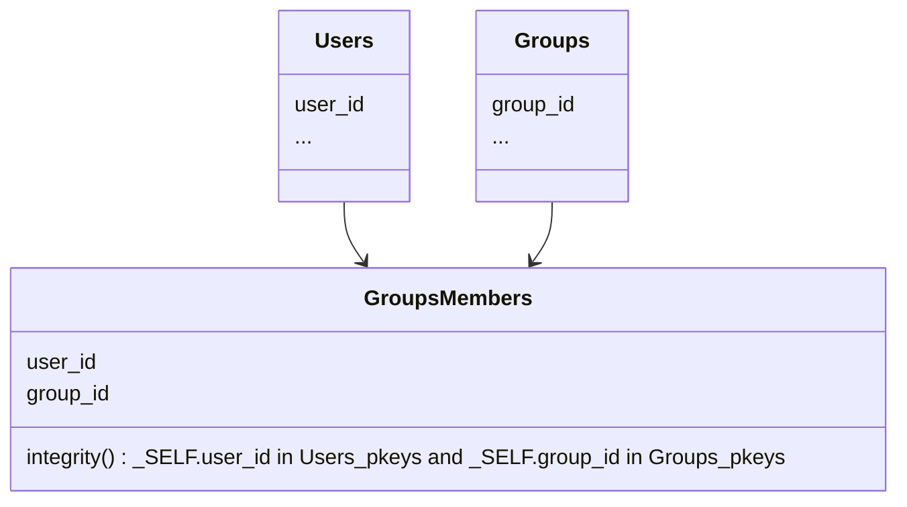

Hermes-server peut gérer plusieurs types de données, avec des liens (*[clés étrangères](/hermes/how-it-works/hermes-client/foreign-keys/)*) entre eux, et peut leur appliquer des contraintes d'intégrité.

Illustrons cela avec un cas d'utilisation typique d'utilisateurs / groupes / membres de groupes.

Dans ce scénario, les entrées dans `GroupsMembers` qui ont un `user_id` qui n'existe pas dans `Users`, ou un `group_id` qui n'existe pas dans `Groups` seront ignorées silencieusement.

Pour plus de détails, veuillez consulter [integrity_constraints](/setup/configuration/hermes-server/#hermes-server.datamodel.data-type-name.integrity_constraints) dans la configuration d'hermes-server.
