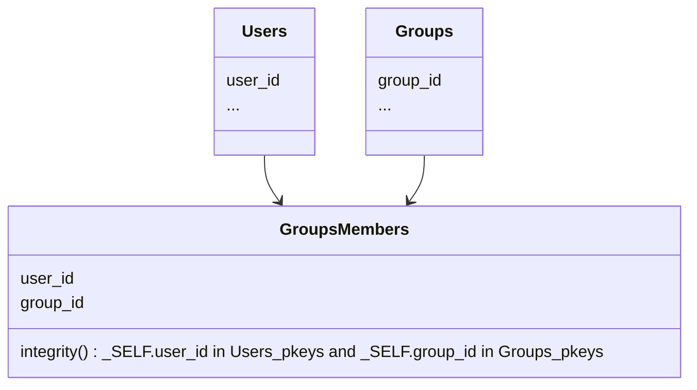

Hermes-server can handle several data types, with link (*[foreign keys](/hermes/how-it-works/hermes-client/foreign-keys/)*) between them, and to enforce integrity constraints.

Let's use a typical Users / Groups / GroupsMember use case to illustrate this.

In this scenario, entries in `GroupsMembers` that have a `user_id` that doesn't exist in `Users`, or a `group_id` that doesn't exist in `Groups` will be silently ignored.

For more details, please see [integrity_constraints](/setup/configuration/hermes-server/#hermes-server.datamodel.data-type-name.integrity_constraints) in hermes-server configuration.
